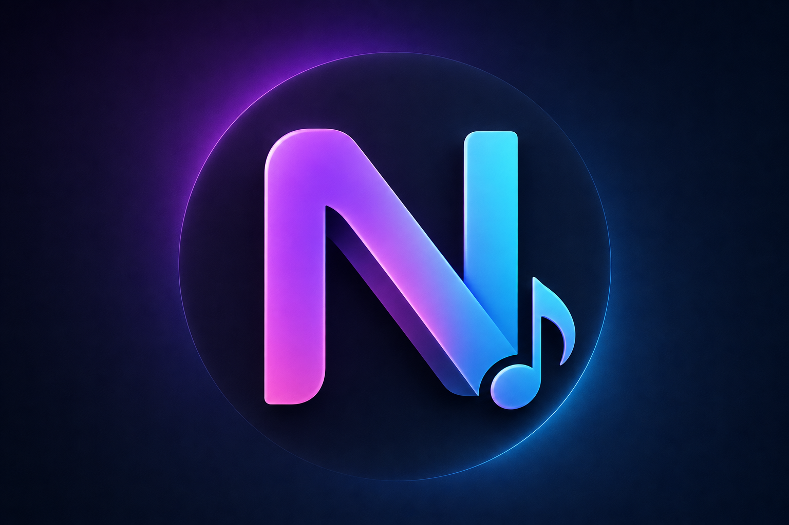

[README.md](https://github.com/user-attachments/files/31612070/README.md)
<div align="center">
  

  <h1>NiMusic</h1>

  <p><strong>A modern Android music player with smart recommendations, local playback, playlists, lyrics, downloads, and background media controls.</strong></p>

  <p>
    <a href="https://github.com/NAznaveh/Nimuzic">Repository</a> ·
    <a href="https://ai.studio/">Google AI Studio</a>
  </p>

  <p>
    
    
    
    
  </p>
</div>

## Overview

NiMusic is a native Android music player built with Kotlin and Jetpack Compose. It is designed around a clean, modern player experience while combining local music playback with online discovery and download features.

The project includes a context-aware **Smart Shuffle** engine that learns from playback behavior, early skips, recent history, and music metadata to maintain a continuously updated Up Next queue instead of repeatedly generating an unrelated list.

> **Project status:** Active development. The repository reflects the latest development build; store-ready APK/AAB packaging is planned as a later step.

## Highlights

### Smart Shuffle

- Context-aware recommendations based on the current track and manual selections.
- Incremental Up Next window with up to 20 recommendations.
- Preserves relevant upcoming tracks when the current song changes.
- Learns from early skips and applies decaying negative feedback.
- Artist and album diversity across the whole recommendation window.
- Genre/style normalization with conservative related-genre matching.
- Temporary exclusions for manually removed recommendations.
- Stale background recommendation jobs are rejected before they can overwrite newer state.

### Playback

- Local music library scanning through Android MediaStore.
- Standard queue playback.
- Standard random shuffle.
- True Fair Shuffle / non-repeat behavior.
- Smart Shuffle.
- Repeat One support.
- Play Next support.
- Seeking and playback progress.
- Playback speed controls.
- Background playback with Android media notifications and system media controls.
- Audio-focus handling for interruptions from other apps.

### Music Library & Organization

- Favorites playlist.
- Custom playlists with track management and drag-and-drop support.
- Downloaded tracks for offline playback.
- Online music search/browser flow.
- Lyrics viewer with online retrieval support.

### Personalization

- Multiple visual themes, including dark, light, AMOLED, and neon styles.
- Built-in equalizer controls.
- Sleep timer.
- English and Persian UI strings.

## Technology Stack

- **Kotlin**
- **Jetpack Compose + Material 3**
- **Android MediaPlayer + MediaSession** for playback and system media controls
- **Room** for local persistence
- **Kotlin Coroutines / Flow** for asynchronous state and background work
- **Coil** for image loading
- **Retrofit + OkHttp + Moshi** for networking/data handling
- **Firebase AI** integration
- **Gradle Kotlin DSL**

## Project Structure

```text
app/
├── src/main/java/com/example/
│   ├── data/              # Room database and models
│   ├── player/            # Playback, MediaSession, Smart Shuffle
│   ├── repository/        # Data and download repositories
│   └── ui/                # Compose screens, components, themes
├── src/test/               # Unit and Compose-related tests
└── src/androidTest/        # Instrumentation tests

gradle/
build.gradle.kts
settings.gradle.kts
metadata.json
```

## Getting Started

NiMusic is currently under active development.

This repository is primarily intended for portfolio presentation, code review, and educational reference.

For development or collaboration access, please contact the repository owner.

## Smart Shuffle Design

Smart Shuffle is intentionally separated from normal queue playback. The recommendation engine works from immutable snapshots of playback context and history, performs scoring in the background, and publishes a result only when the playback session and recommendation generation token are still current.

The recommendation window follows two different behaviors:

- **Manual selection:** reset the recommendation context around the newly selected track.
- **Automatic transition:** preserve relevant existing Up Next items, re-rank them against the new current track, and replenish only missing slots.

This keeps the queue coherent instead of replacing all upcoming tracks after every transition.

## Security

Never commit API keys, keystores, signing passwords, or other secrets to the repository.

The project includes `.env.example` for local configuration, while `.env` is intentionally ignored by Git.

## Contributing

This project is currently maintained as an active personal development project. Issues, technical feedback, and thoughtful pull requests are welcome.

For changes to playback or Smart Shuffle, prefer small, focused commits and preserve the existing playback-session and stale-callback protections.

## License

NiMusic is proprietary software. All rights reserved.

Viewing and studying the source code for personal, educational, and evaluation purposes is permitted. Copying, modifying, distributing, selling, or commercially using the software or substantial portions of its source code requires prior written permission from the copyright holder.

See the [LICENSE](LICENSE) file for the full terms.

## Roadmap

- [ ] Finalize and validate Smart Shuffle behavior on physical devices
- [ ] Stabilize release signing and generate production APK/AAB builds
- [ ] Prepare store metadata and publishing assets
- [ ] Publish a public release build
